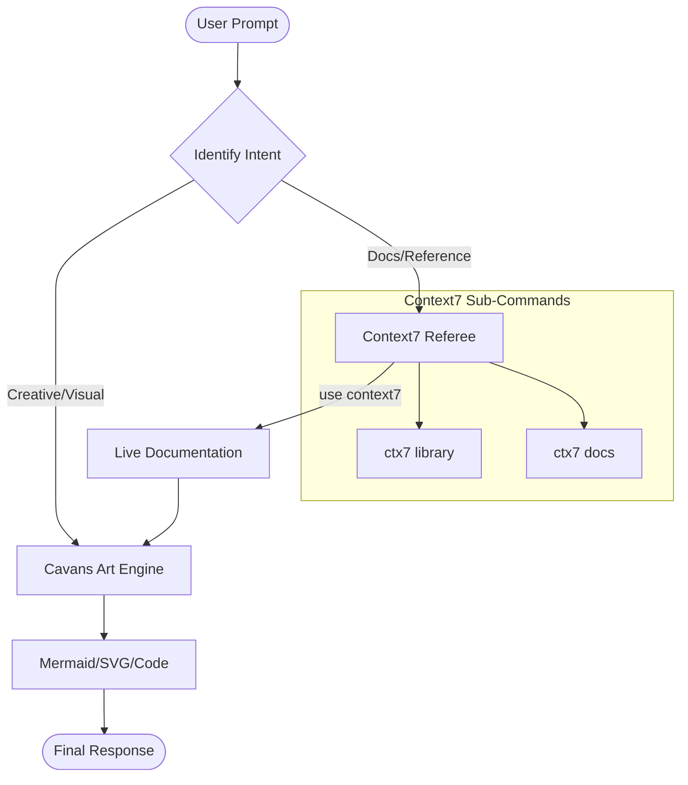

# Cavans Art & Context7 Integration

## Description
This skill orchestrates creative output via **Cavans Art** and validates technical
implementation using **Context7** live documentation. It ensures that any code or
visual logic generated is both aesthetically sound and technically up-to-date.

## Logic Flow (Myrimaids Graph)

## Auto-Trigger Patterns

The skill activates automatically (no explicit `/skill` invocation required) on:

| Trigger Phrase / Pattern              | Routed To           |
| ------------------------------------- | ------------------- |
| `use context7`                        | Context7 Referee    |
| `ctx7 library <name>`                 | Context7 → Lib      |
| `ctx7 docs <topic>`                   | Context7 → Doc      |
| `draw …`, `diagram …`, `visualize …`  | Cavans Art Engine   |
| `mermaid …`, `svg …`, `flowchart …`   | Cavans Art Engine   |
| Creative request + library reference  | C7 → CA pipeline    |

## Sub-Commands

- **`ctx7 library <name>`** — resolve a library identifier and load its current
  documentation surface.
- **`ctx7 docs <topic>`** — fetch focused documentation pages for a specific topic
  or API.
- **`cavans render <spec>`** — produce a Mermaid, SVG, or annotated code artifact
  from a structured spec.

## Workflow

1. **Identify intent** — classify the prompt as Creative/Visual, Docs/Reference,
   or a combination.
2. **Fetch references first** — if docs are needed, run Context7 lookups before
   generating any artifact so the output reflects current APIs.
3. **Generate the artifact** — hand the validated references to the Cavans Art
   Engine to produce the visual or code output.
4. **Return the final response** — include the artifact plus a short note on
   which doc versions were consulted.
