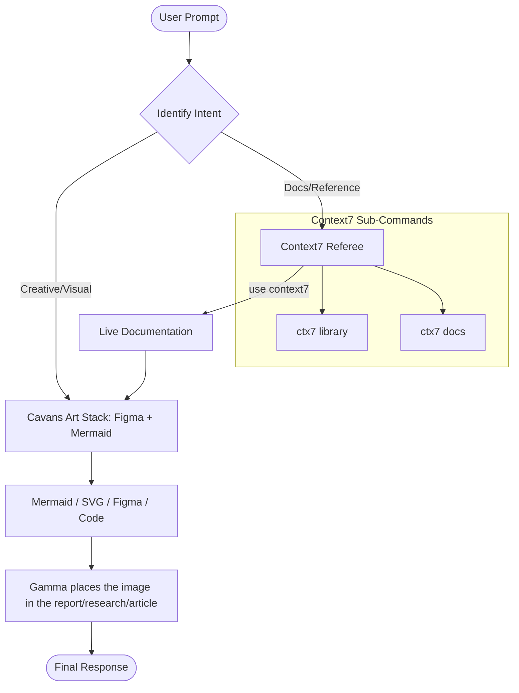

# Cavans Art & Context7 Integration

## Description
This skill orchestrates creative output via the **Cavans Art** stack and validates
technical implementation using **Context7** live documentation. It ensures that any
code or visual logic generated is both aesthetically sound and technically
up-to-date.

## Integrations (verified & ready)

| Integration  | Role                                                                 | Status                                                          |
| ------------ | -------------------------------------------------------------------- | --------------------------------------------------------------- |
| **Figma**    | Larger art projects — design context, screenshots, FigJam diagrams   | Integrated (MCP server)                                         |
| **Mermaid**  | Larger art projects — validates & renders Mermaid diagrams to a widget | Integrated — `validate_and_render_mermaid_diagram` (verified)  |
| **Gamma**    | Used mid-pipeline to place a generated image inside the report / research / article | Integrated (MCP server)                            |
| **Context7** | Live documentation referee — fetches current library / API docs      | Integrated via `npx` / `npm` (the only npx-based integration)   |

## Logic Flow (Mermaid Graph)

## Auto-Trigger Patterns

The skill activates automatically (no explicit `/skill` invocation required) on:

| Trigger Phrase / Pattern               | Routed To                          |
| --------------------------------------- | ---------------------------------- |
| `use context7`                          | Context7 Referee                   |
| `ctx7 library <name>`                   | Context7 → Lib                     |
| `ctx7 docs <topic>`                     | Context7 → Doc                     |
| `draw …`, `diagram …`, `visualize …`    | Cavans Art Stack (Figma + Mermaid) |
| `mermaid …`, `svg …`, `flowchart …`     | Cavans Art Stack (Figma + Mermaid) |
| Figma URL or "Figma file" reference     | Cavans Art Stack → Figma           |
| "add an image to the report/article"    | Gamma                              |
| Creative request + library reference    | C7 → CA → Gamma pipeline           |

## Sub-Commands

- **`ctx7 library <name>`** — resolve a library identifier and load its current
  documentation surface (Context7, npx/npm-based).
- **`ctx7 docs <topic>`** — fetch focused documentation pages for a specific topic
  or API (Context7, npx/npm-based).
- **`cavans render <spec>`** — produce a Mermaid, Figma, SVG, or annotated code
  artifact from a structured spec.
- **`gamma place <artifact>`** — take a finished artifact and, using Gamma, embed
  the image inside the target report / research write-up / article.

## Workflow

1. **Identify intent** — classify the prompt as Creative/Visual, Docs/Reference,
   or a combination.
2. **Fetch references first** — if docs are needed, Context7 (the npx/npm-based
   integration) runs its lookups before any artifact is generated, so the output
   reflects current APIs.
3. **Generate the artifact** — the Cavans Art stack (Figma for larger art
   projects, Mermaid for rendered diagrams) produces the visual or code output.
4. **Place the image** — Gamma then takes that artifact and drops the image into
   the report, research write-up, or article where it belongs.
5. **Return the final response** — include the artifact plus a short note on which
   doc versions Context7 consulted.
